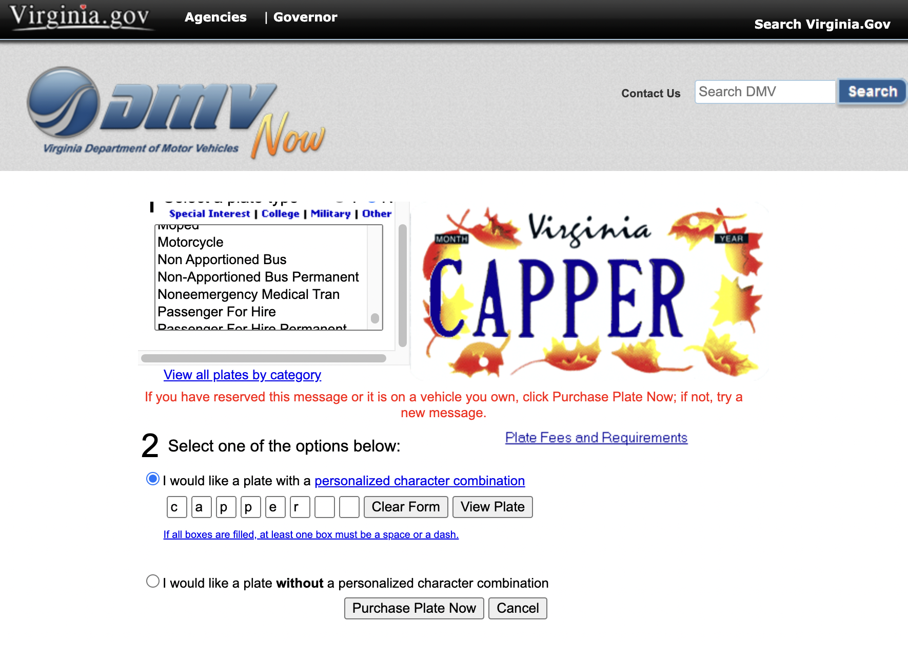

# VirginiaVanityPlateChecker


[Virginia DMV](https://www.dmv.virginia.gov/dmvnet/plate_purchase/select_plate.asp) allows you to check whether custom vanity plates are available for your vehicle. The website is slow, and gets tedious to check multiple custom plates.

This python script automates this process, and will allow you to check the availability of multiple plates at a time.

Just create a txt file ("input.txt") with all the plate names you want to check, and run the script. It will output a file called "output.txt" to show whether the plate is available or not.

## Getting Started

Dependencies:
* Python 3.9.10 
    * [Requests](https://pypi.org/project/requests/)
* [beautifulsoup4](https://pypi.org/project/beautifulsoup4/) 
* [tqdm](https://pypi.org/project/tqdm/)

Run the following commands to install the dependencies
```
python -m venv venv 
source venv/bin/activate
pip install -r requirements.txt
```

Now you're ready to run the script!

```
python main.py
```

